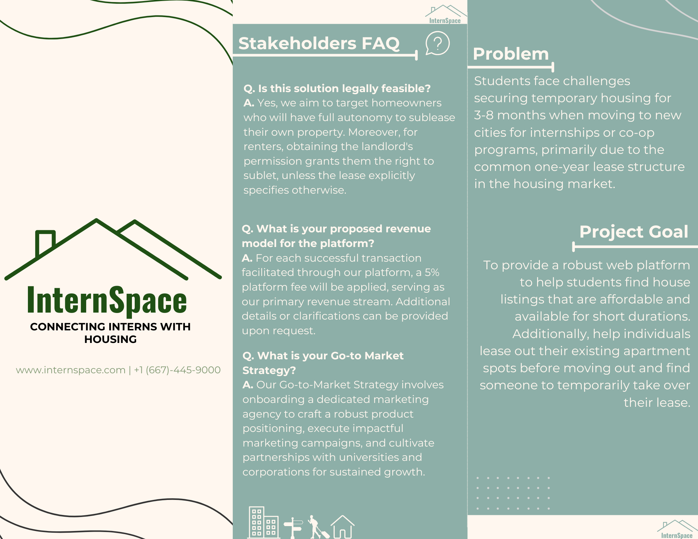
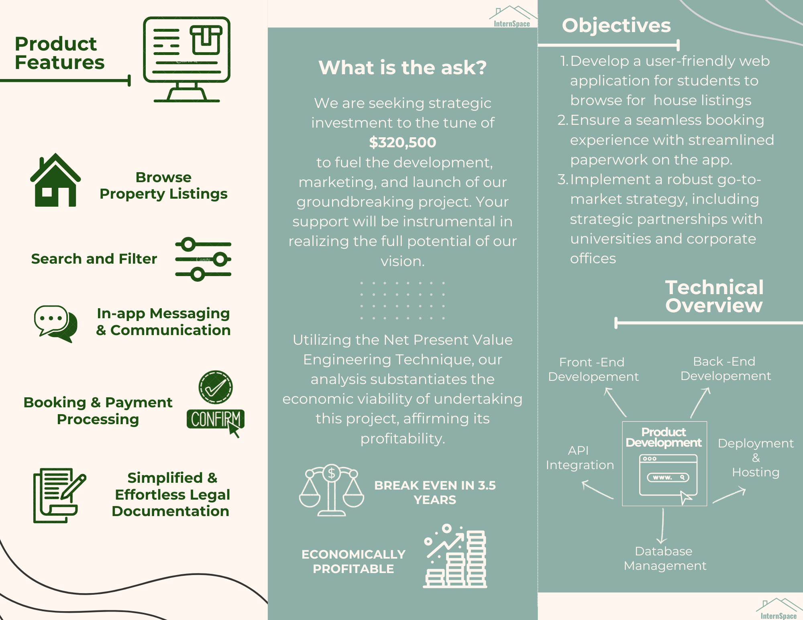

# **Project Management: InternSpace**

## **Brief Description**
InternSpace is a project aimed at addressing the housing challenges faced by students relocating for short-term internships or co-ops. The project proposed a web application platform to streamline temporary housing solutions, aligning with the unique needs of students and property owners. Our team successfully delivered key project management artifacts including:  
- **[Work Breakdown Structure (WBS)](artifacts/WBS.pdf):** Provides a hierarchical decomposition of project tasks for efficient planning and execution.  
- **[Gantt Chart](artifacts/Gantt.pdf):** A visual representation of the project schedule over a 27-week timeline.  
- **[RACI Matrix](artifacts/RACI.pdf):** Defines team roles and responsibilities to ensure clarity and accountability.  
- **[Risk Mitigation Plan](artifacts/Risk.pdf):** Identifies project risks and outlines strategies to reduce potential delays by 40%.  
- **[Budget & Economic Viability Analysis](artifacts/Budget.pdf):** Ensures accurate cost estimation (95% accuracy) and justifies economic viability using NPV analysis.  

The platform ensures affordability, optimized resource allocation, and reduces project delays through tailored strategies.

---

## **Brochure Presented to Stakeholders**

### **Page 1**  

### **Page 2**  

---

## **Final Presentation**  
[View the Final Presentation](ProjectProposalPresentation.pdf)

---
